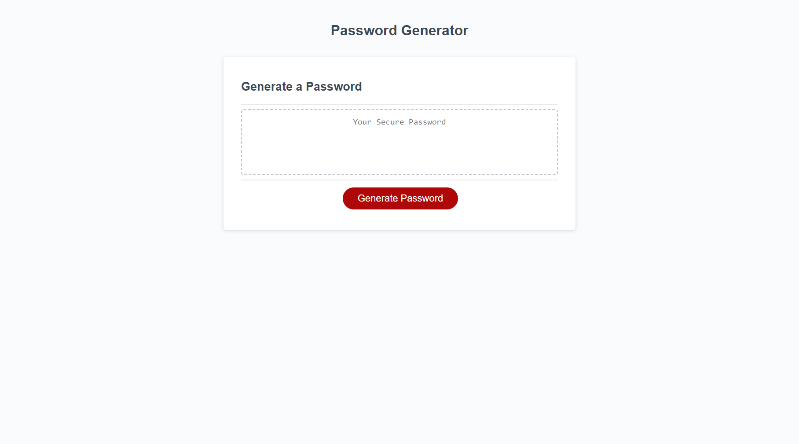

## Name

Password Generator built for uniqueness!

## Description

A password generator website for your personal use. This password generator will customize a unique password based on the password criteria you include!

## Badges

## Visuals

## Usage

To use the password generator, click the "Generate Password" button. Once clicked, a window prompt will appear at the top of the page. This prompt will ask you to input the a number, which indicates the length of your customized password. When confirmed, four questions will be asked to further customize your password. Upon completion of questions your password will be generated in the display box on the webpage! 

## Support

If you come across a bug or just have any feedback, support can be contacted at DJonHarrison94@gmail.com!

## License

MIT License

Copyright (c) 2022 DJonJasmine

Permission is hereby granted, free of charge, to any person obtaining a copy
of this software and associated documentation files (the "Software"), to deal
in the Software without restriction, including without limitation the rights
to use, copy, modify, merge, publish, distribute, sublicense, and/or sell
copies of the Software, and to permit persons to whom the Software is
furnished to do so, subject to the following conditions:

The above copyright notice and this permission notice shall be included in all
copies or substantial portions of the Software.

THE SOFTWARE IS PROVIDED "AS IS", WITHOUT WARRANTY OF ANY KIND, EXPRESS OR
IMPLIED, INCLUDING BUT NOT LIMITED TO THE WARRANTIES OF MERCHANTABILITY,
FITNESS FOR A PARTICULAR PURPOSE AND NONINFRINGEMENT. IN NO EVENT SHALL THE
AUTHORS OR COPYRIGHT HOLDERS BE LIABLE FOR ANY CLAIM, DAMAGES OR OTHER
LIABILITY, WHETHER IN AN ACTION OF CONTRACT, TORT OR OTHERWISE, ARISING FROM,
OUT OF OR IN CONNECTION WITH THE SOFTWARE OR THE USE OR OTHER DEALINGS IN THE
SOFTWARE.
